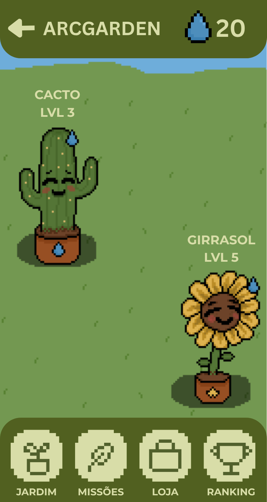

## GERAL

Front-end do projeto chamado ArcGarden desenvolvido pela equipe ARCEUS para o Challenge Fiap 2026

## PROJETO ArcGarden

O ArcGarden é um sistema de jardim virtual sustentável. Seu funcionamento é 
baseado na realização de ações voltadas ao meio ambiente no mundo real, que geram 
progresso dentro da plataforma.

Ao iniciar o jogo o usuário escolhe sua planta inicial 
e conforme participa das atividades propostas, evolui suas plantas, desbloqueia itens 
e acompanha o crescimento do próprio jardim, que é público e poderá ser visitado por 
outros.

## TECNOLOGIAS

### SITE
No front-end do projeto foram utilizadas as linguagens HTML, CSS, e Javascript.

- #### HTML
    Utilizado para a marcação do website.
- #### CSS
    Utilizado para a estilização do website.
- #### JAVASCRIPT
    Utilizado para algumas funcionalidades como para a barra de navegação responsiva com "Hambúrger" e também para o enfio do formulário na página "Contato".

### DESIGN
Também foram utilizados para o design o Figma, e para os elementos visuais Pixel-Art foi usado o ASEPRITE.

- #### FIGMA
    Utilizado para desenvolver o design do site pré implementação.

- #### ASEPRITE
    Utilizado para fazer os elementos Pixel-Art presentes no site.

## ESTRUTURAS DE PASTAS

No projeto estão separados nas pastas
- css: contém os arquivos de estilo
- pages: Contém os HTMLs
- js: Contém o arquivo javascript
- images: Contém as imagens utilizadas no projeto
- O arquivo index.html e README.md estão ambos na raiz do projeto

## Autores do Arcgarden

links das redes sociais:

### Danielle Kagan

github 
- Github: https://github.com/daniellekgn
- Linkedin: https://www.linkedin.com/in/danielle-fernanda-69a974405/

### Igor Mateus

- Github: https://github.com/HayanoIche
- Linkedin: https://www.linkedin.com/in/igor-mateus-da-silva-4b05013ba/

### Marcela Batista

- Github: https://github.com/wonbindasilva
- Linkedin: https://www.linkedin.com/in/marcelabteixeira/

### Matheus Pereira

- Github: 
- Linkedin:

## Representação do projeto

Fluxo da gameplay do ArcGarden:

Exemplo de UI:
 

## Contato

Qualquer sujestão ou duvida mande um email para a equipe!

Email de contato: oarcgarden@gmail.com